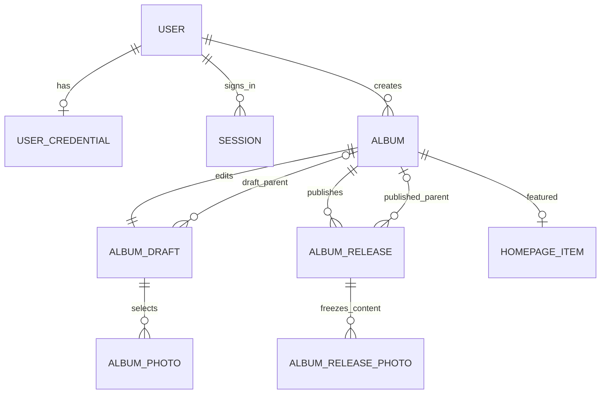

# Gallery 数据库设计与完整数据字典

> 2026-09-11 范围修订：见 [ADR 0002](../decisions/0002-albums-first.md)。首页／地图暂缓，详细介绍不再插图，关于未来由文章选篇。本文保留已验证结构和扩展边界，不代表相应 UI 仍在 MVP；文章模块仍未建表；认证限流见迁移 0003，Markdown、照片组及时间轴见文末 0004 增量。

状态：0001–0005 与真实应用已通过隔离 PostgreSQL 14 验证；本次本地接入见 [单项发布交付](../delivery/item-publication.md)。版本：0.5，2026-09-12。

## 1. 设计边界

同一 PostgreSQL 数据库内，Immich 表保留在 `public`，新增表位于 `gallery`。同库跨 schema 可以普通 JOIN；不使用跨数据库查询扩展。Gallery 的数据库角色、迁移和用户体系独立。

- Immich Asset 是资源身份；Gallery Album 是编辑与展示主体。
- 不保存 `source_album_id`，不限制一册来自一个 Immich 相册。
- Gallery 相册可直接选片，也可包含子相册；所有层级都可写游记。
- 不存 GPS 副本：公开地图实时通过受控视图读取 `public.asset_exif`，然后应用当前发布的公开精度。
- Gallery 文案、照片成员、排序、封面、父级与公开设置使用草稿／发布快照。
- 不给 Immich 核心表加字段、触发器或 Gallery 外键；自身表间正常使用外键。

## 2. 表目录：14 张业务表（含认证限流）+ 1 张迁移表

| 表 | 用途 |
|---|---|
| `gallery.user` | 独立用户身份和角色 |
| `gallery.user_credential` | 密码哈希，与用户资料分开 |
| `gallery.session` | 可撤销登录会话 |
| `gallery.auth_throttle` | 登录及密码修改的持久化限流 |
| `gallery.site` | 单站点配置及全局编辑并发版本 |
| `gallery.immich_source_owner` | 允许引用的 Immich 资源所有者白名单 |
| `gallery.asset_entry` | 全局 Asset 首次加入 Gallery 的时间与历史估算标记，详见 0004 增量 |
| `gallery.album` | 相册稳定身份、slug、发布状态及当前版本指针 |
| `gallery.album_draft` | 当前相册草稿、父级和相册内容 |
| `gallery.album_photo` | 草稿中的直接照片、独立标题描述及顺序 |
| `gallery.album_release` | 不可变的发布内容快照，包含发布父级 |
| `gallery.album_release_photo` | 该次发布的选片、标题和描述快照 |
| `gallery.homepage_item` | 首页精选相册与顺序 |
| `gallery.audit_event` | 管理操作审计摘要 |
| `gallery.schema_migration` | Gallery 自己的迁移记录 |

不为留言、评分、收藏、缓存、地图聚合、分类或第三方登录预建空表。

## 3. 全局字段约定

- 表名和列名统一 snake_case，查询使用明确 schema；`gallery.user` 始终限定名称。
- 下列表格中“必填”表示 NOT NULL；明确标记“可空”的字段才允许 NULL。
- UUID 主键由应用生成 UUIDv4，不调用 Immich 自定义函数；无须把 UUID 当同步游标。
- 所有创建时间必填，默认 `now()`；更新时间必填，初始 `now()`，业务写入时更新。
- 版本号为 bigint，默认 1，CHECK > 0，服务端处理精度，不以 JavaScript 普通 number 承载任意 bigint。
- 状态使用 text + CHECK，避免依赖上游枚举。字符串限制、JSON 结构和 URL 校验由服务端执行，关键范围再落 DB CHECK。
- 所有 Gallery 外键默认 ON UPDATE RESTRICT。除特别说明的 CASCADE/SET NULL 外，ON DELETE RESTRICT。
- 管理员账号采用停用，不提供物理删除 UI；发布过的相册只下线，MVP 不硬删除。
- 空文档／对象／数组默认值均为明确 JSONB 字面量；封面、相机参数与正文内容由版本化校验器限制键集合。发布表没有草稿的宽松空标题默认值。

## 4. `gallery.user`

| 字段 | 定义 | 解释 |
|---|---|---|
| `id` | uuid，PK，必填 | Gallery 用户，与 Immich 用户无绑定关系 |
| `email` | text，必填 | 登录邮箱，保留用户输入的显示形式 |
| `email_normalized` | text，必填，UNIQUE | 统一去首尾空格、大小写规范化，用于登录和判重；不合并点号或加号别名 |
| `display_name` | text，必填 | 昵称，1–100 字符 |
| `role` | text，必填，默认 member | CHECK IN ('admin','member')；初始化命令显式创建 admin |
| `status` | text，必填，默认 active | CHECK IN ('active','disabled') |
| `created_at` | timestamptz，必填，默认 now() | 创建时间 |
| `updated_at` | timestamptz，必填，默认 now() | 修改时间 |

索引：主键、规范化邮箱唯一索引。MVP 不开放注册，未来注册接口只能服务端赋予 member。保留至少一个可用管理员由受控管理命令校验。

## 5. `gallery.user_credential`

| 字段 | 定义 | 解释 |
|---|---|---|
| `user_id` | uuid，PK，FK → user.id，必填 | 一人一条密码凭据；ON DELETE CASCADE |
| `password_hash` | text，必填 | 版本化密码哈希，使用 Node crypto.scrypt；scrypt-v1 固定 N=32768、r=8、p=3、随机 16 字节盐、64 字节密钥 |
| `password_changed_at` | timestamptz，必填，默认 now() | 最近密码变更时间 |
| `created_at` | timestamptz，必填，默认 now() | 创建时间 |
| `updated_at` | timestamptz，必填，默认 now() | 更新时间 |

不存明文、可逆密文或密码提示。密码变更与会话撤销在同一事务完成。该表不给公开数据库角色任何权限。

## 6. `gallery.session`

| 字段 | 定义 | 解释 |
|---|---|---|
| `id` | uuid，PK，必填 | 会话内部 ID |
| `user_id` | uuid，FK → user.id，必填 | ON DELETE CASCADE |
| `token_hash` | bytea，UNIQUE，必填 | 高熵随机令牌的 SHA-256 摘要；CHECK octet_length = 32；不是密码哈希 |
| `audience` | text，必填 | CHECK IN ('admin','public')；MVP 仅签发 admin |
| `created_at` | timestamptz，必填，默认 now() | 登录时间 |
| `expires_at` | timestamptz，必填 | CHECK expires_at > created_at |
| `revoked_at` | timestamptz，可空 | 撤销后不能再使用 |

索引：user_id、expires_at、token_hash 唯一索引。服务端每次校验 token、过期、撤销、用户启用状态和 audience。原令牌只用于 host-only HttpOnly Cookie；后台和未来前台不共享父域 Cookie。

## 7. `gallery.site`

| 字段 | 定义 | 解释 |
|---|---|---|
| `id` | smallint，PK，必填，CHECK id = 1 | 单站点记录；所有 Gallery 相册都属于它，无需在每张表重复 site_id |
| `name` | text，必填 | 站点名，1–100 字符 |
| `tagline` | text，必填，默认 '' | 简短标语 |
| `intro` | text，必填，默认 '' | 首页介绍 |
| `about_document` | jsonb，必填，默认空文档 | 既有关于正文结构；未来文章选篇不以此字段冒充关联，需另行设计新迁移 |
| `contact_links` | jsonb，必填，默认 [] | 受限的 label/url 列表，最多 10 项；应用允许 HTTP／HTTPS／mailto，拒绝凭据型 URL 和脚本协议 |
| `hero_album_id` | uuid，可空，FK → album.id | 首页主视觉使用所选相册当前有效封面；允许先无主视觉 |
| `seo_description` | text，必填，默认 '' | 网站默认摘要 |
| `version` | bigint，必填，默认 1 | 站点设置与精选编辑的并发版本 |
| `tree_version` | bigint，必填，默认 1 | 相册草稿层级／排序变化及发布结构变化时递增，供树编辑冲突检测 |
| `updated_by` | uuid，可空，FK → user.id | 初始化可为空，管理操作必须填写 |
| `updated_at` | timestamptz，必填，默认 now() | 站点设置更新时间 |

domain、数据库密码、session secret、地图服务密钥不在此表，使用部署配置。tree_version 的更新不代表站点文字变更；操作详情进 audit_event。

## 8. `gallery.immich_source_owner`

这是一张资源范围配置表，不是两个产品的用户映射。

| 字段 | 定义 | 解释 |
|---|---|---|
| `immich_owner_id` | uuid，PK，必填 | 被允许读取的 Immich asset.ownerId，无跨 schema FK |
| `label` | text，必填，默认 '' | 本地配置说明，不复制完整 Immich 用户资料 |
| `enabled` | boolean，必填，默认 true | 禁用后，选片与公开请求立即排除该所有者资源 |
| `created_at` | timestamptz，必填，默认 now() | 加入时间 |
| `updated_at` | timestamptz，必填，默认 now() | 修改时间 |

仅由初始化／受控配置命令维护，常驻 gallery_admin 也不能写；public 角色只经视图间接使用。初始为空，不自动信任所有 Immich 用户。独立于 Gallery user.id，未来增加成员不会扩大资源来源范围。

## 9. `gallery.album`

| 字段 | 定义 | 解释 |
|---|---|---|
| `id` | uuid，PK，必填 | 稳定 Gallery 相册 ID |
| `slug` | text，UNIQUE，必填 | 1–120 字符，小写 ASCII 字母数字及连字符，无斜线；中文标题可配拼音或短 ID 地址 |
| `status` | text，必填，默认 draft | CHECK IN ('draft','published','offline') |
| `current_release_id` | uuid，可空 | 当前发布快照；下线时保留，但查询必须检查有效公开状态 |
| `version` | bigint，必填，默认 1 | 控制发布／下线／slug 等并发操作 |
| `created_by` | uuid，必填，FK → user.id | 创建管理员 |
| `created_at` | timestamptz，必填，默认 now() | 创建时间 |
| `updated_at` | timestamptz，必填，默认 now() | 相册管理状态更新时间 |
| `first_published_at` | timestamptz，可空 | 首次发布时间；一旦存在则 slug 不再可改 |
| `last_published_at` | timestamptz，可空 | 最近一次切换到发布快照的时间 |
| `offline_at` | timestamptz，可空 | 当前手动下线时间；仅被祖先阻断不修改自身字段 |

CHECK：draft 时 current_release_id/first_published_at/last_published_at/offline_at 均为空；published/offline 时前三者非空；published 时 offline_at 为空，offline 时非空。

组合 FK `(id,current_release_id) → album_release(album_id,id)`，确保不会指向别册版本。该 FK 在 release 表建立后添加，可延迟校验；NULL 指针适用于初始草稿。状态过滤与首次发布时间索引服务目录分页；其他列表先按索引＋实际查询计划优化。

本表没有 source_album_id，也不放可立即影响前台的 parent_album_id。父级保存在草稿和发布快照，避免保存草稿就改变线上结构。

## 10. `gallery.album_draft`

| 字段 | 定义 | 解释 |
|---|---|---|
| `album_id` | uuid，PK，FK → album.id，必填 | 每册唯一当前草稿，ON DELETE CASCADE |
| `parent_album_id` | uuid，可空，FK → album.id | 草稿父级；NULL 为顶级；CHECK parent_album_id <> album_id |
| `position` | bigint，必填，默认 0，CHECK >= 0 | 同级顺序键，允许间隔值；并列时按 album_id 稳定排序 |
| `title` | text，必填，默认 '' | 创建后可为空，发布时必须 1–200 字符 |
| `summary` | text，必填，默认 '' | 纯文本简介，最多 2000 字符 |
| `description_document` | jsonb，必填，默认空文档 | 相册富文本总体游记，含 schemaVersion |
| `cover_asset_id` | uuid，可空 | 明确引用封面 Asset，可为直接照片或有效公开后代照片；无跨库 FK |
| `cover_focal_point` | jsonb，可空 | {x,y}，各在 [0,1]，未设置时居中 |
| `location_mode` | text，必填，默认 hidden | CHECK IN ('hidden','approximate','exact')，本相册直接照片的位置公开上限 |
| `show_exif` | boolean，必填，默认 false | 是否显示筛选后的摄影参数 |
| `seo_title` | text，可空 | 空时使用相册标题 |
| `seo_description` | text，可空 | 空时使用简介 |
| `version` | bigint，必填，默认 1 | 任意正文、照片或草稿结构修改均递增 |
| `updated_by` | uuid，FK → user.id，必填 | 最后编辑者 |
| `updated_at` | timestamptz，必填，默认 now() | 更新时间 |

索引 `(parent_album_id,position,album_id)`，支持草稿树。非自指 CHECK 不能阻止多节点循环，完整防环与并发规则见发布文档。

## 11. `gallery.album_photo`

本表保存当前草稿的直接选片。它不是可被公众直接读取的照片表。

| 字段 | 定义 | 解释 |
|---|---|---|
| `id` | uuid，PK，必填 | Gallery 相册照片 ID，标题／排序修改时保持稳定 |
| `album_id` | uuid，FK → album_draft.album_id，必填 | ON DELETE CASCADE |
| `immich_asset_id` | uuid，必填 | 资源引用，无指向 Immich 的 FK |
| `position` | integer，必填，CHECK >= 0 | 相册内照片顺序 |
| `title` | text，必填，默认 '' | Gallery 独立标题，最多 200 字符 |
| `description` | text，必填，默认 '' | 独立描述，最多 50000 字符；由 description_format 区分旧纯文本与 Markdown |
| `alt_text` | text，必填，默认 '' | 替代文本，最多 500 字符 |
| `location_mode` | text，必填，默认 inherit | CHECK IN ('inherit','hidden','approximate','exact')；只能在相册上限内生效 |
| `created_at` | timestamptz，必填，默认 now() | 加入草稿时间 |
| `updated_at` | timestamptz，必填，默认 now() | 本记录修改时间 |

UNIQUE `(album_id,immich_asset_id)` 防止同册重复；UNIQUE `(album_id,position)` 设为可延迟，以便事务内批量换序；建立 `(immich_asset_id,album_id)` 反查索引。

每次新增、修改、移除照片必须锁定并更新 album_draft.version。移除草稿行不影响已有 release；重新加入同 Asset 可生成新 id，预览会提示旧照片链接在更新发布后失效。快照不外键关联这张可删除的草稿表。

## 12. `gallery.album_release`

| 字段 | 定义 | 解释 |
|---|---|---|
| `id` | uuid，PK，必填 | 发布版本 ID |
| `album_id` | uuid，FK → album.id，必填 | 所属相册 |
| `release_number` | integer，必填，CHECK > 0 | 册内递增，锁 album 行后分配 |
| `source_draft_version` | bigint，必填，CHECK > 0 | 发布源草稿版本；0005 起不单独用于判断未发布修改 |
| `parent_album_id` | uuid，可空，FK → album.id | 本版本的父级，非自指；公开树按各册 current_release 解析 |
| `position` | bigint，必填，CHECK >= 0 | 本次发布的同级顺序键 |
| `title` | text，必填 | 1–200 字符 |
| `summary` | text，必填 | 发布时简介 |
| `description_document` | jsonb，必填 | 发布时游记文档，必须通过结构校验 |
| `cover_asset_id` | uuid，可空 | 发布封面；无封面的纯父相册允许先发布，前台显示设计好的占位 |
| `cover_focal_point` | jsonb，可空 | 发布时裁切焦点 |
| `location_mode` | text，必填 | hidden/approximate/exact |
| `show_exif` | boolean，必填 | 发布时摄影参数公开设置 |
| `seo_title` | text，可空 | 发布时页面标题覆盖 |
| `seo_description` | text，可空 | 发布时摘要覆盖 |
| `content_schema_version` | integer，必填，默认 1，CHECK > 0 | 快照格式版本，与迁移版本不同 |
| `published_by` | uuid，FK → user.id，必填 | 发布管理员 |
| `published_at` | timestamptz，必填，默认 now() | 快照建立时间 |

UNIQUE `(album_id,id)` 服务组合 FK；UNIQUE `(album_id,release_number)` 防重复版本；索引 `(parent_album_id,position,album_id)` 服务公开树遍历。每次发布插入新行，不更新旧快照。

未在此表保存 GPS、城市、文件系统路径、密码或 Immich 描述。旧快照不意味着继续获得资源访问权。

## 13. `gallery.album_release_photo`

| 字段 | 定义 | 解释 |
|---|---|---|
| `release_id` | uuid，联合 PK，FK → album_release.id，必填 | 快照照片随快照清理，ON DELETE CASCADE |
| `photo_id` | uuid，联合 PK，必填 | 发布时 album_photo.id 的值，独立保存，不 FK 到可删除草稿行 |
| `immich_asset_id` | uuid，必填 | 资源引用，无跨 schema FK |
| `position` | integer，必填，CHECK >= 0 | 发布时顺序 |
| `title` | text，必填 | 发布时 Gallery 标题 |
| `description` | text，必填 | 发布时 Gallery 描述 |
| `alt_text` | text，必填 | 发布时替代文本 |
| `location_mode` | text，必填 | inherit/hidden/approximate/exact，按所属 release 的上限计算 |
| `public_exif` | jsonb，可空 | 仅 make/model/lensModel/fNumber/focalLength/iso/exposureTime 白名单快照；无 GPS |

UNIQUE `(release_id,immich_asset_id)`，UNIQUE `(release_id,position)`；索引 `(immich_asset_id,release_id)`。photo_id 是不可变快照内的逻辑照片身份；应用只有发布事务能写入快照，必须验证它来自该相册草稿。

宽高、可用衍生图和图片内容版本从当前受控资源投影读取，防止 Immich 重建预览后仍用陈旧尺寸。public_exif 在下次 Gallery 发布时更新；GPS 明确不在其中。

## 14. `gallery.homepage_item`

| 字段 | 定义 | 解释 |
|---|---|---|
| `album_id` | uuid，PK，FK → album.id，必填 | 一个相册最多精选一次 |
| `position` | integer，必填，CHECK >= 0 | UNIQUE，可延迟约束，支持批量换序 |
| `created_at` | timestamptz，必填，默认 now() | 加入精选时间 |

修改精选与 site.version 更新同一事务。记录存在不代表可展示，公开视图再次筛选有效公开状态。祖先下线时，相应精选入口自动隐藏。

## 15. `gallery.audit_event`

| 字段 | 定义 | 解释 |
|---|---|---|
| `id` | uuid，PK，必填 | 操作 ID |
| `actor_user_id` | uuid，可空，FK → user.id | 系统初始化可空；ON DELETE SET NULL |
| `action` | text，必填 | 如 album.publish、album.offline、site.update、account.password_reset、source.disable |
| `target_type` | text，必填 | album/site/user/source 等 |
| `target_id` | text，可空 | 对象 ID；多态引用不建立 FK，对象移除后仍保留记录 |
| `details` | jsonb，必填，默认 {} | 版本号、影响数量、结果等允许字段，不保存完整私有正文或凭据 |
| `created_at` | timestamptz，必填，默认 now() | 发生时间 |

索引 `(target_type,target_id,created_at)` 和 created_at。常驻管理角色只有 INSERT，无 UPDATE/DELETE；本期无审计管理 UI，日志保留策略交付时记录。

## 16. `gallery.schema_migration`

| 字段 | 定义 | 解释 |
|---|---|---|
| `version` | text，PK，必填 | 可排序编号，如 0001 |
| `name` | text，必填 | 迁移名称 |
| `checksum` | text，必填 | 文件校验值，发现已执行迁移被改写时拒绝继续 |
| `applied_at` | timestamptz，必填，默认 now() | 执行时间 |

迁移工具最终若需要额外的内部锁表，应记录为技术表并同步文档，不冒充业务表。MVP 使用数据库 advisory lock 串行迁移，事务内完成可事务化 DDL 后登记成功；失败原因记录运行日志。

## 17. 富文本结构

当前 MVP 的文字编辑器支持段落、小标题和引用，不支持插图、任意 HTML、链接或行内加粗。数据库文档形状如下，应用 API 接收其中的 blocks 列表；服务端在写入时补充 schemaVersion。

```json
{
  "schemaVersion": 1,
  "blocks": [
    { "kind": "heading", "text": "清晨抵达" },
    { "kind": "paragraph", "text": "山谷里的光线逐渐明亮。" },
    { "kind": "quote", "text": "沿着山路继续往前。" }
  ]
}
```

下述为旧文档兼容限制，新编辑流程见 0004 增量。限制为最多 200 块、每块 10000 个字符、blocks 序列化长度最多 250000 个字符；HTTP 写请求上限 2000000 字节。应用只接受 kind/text 两个键。单册最多 1000 张照片。该最小文字块编辑器替代早期未实现的 marks/children 结构，后续扩展必须版本化。

## 18. 关系图



图中未把 Immich 逻辑引用画成数据库 FK。`album.current_release_id` 是指向同册某次快照的组合 FK。公开树只使用当前快照，历史快照的 parent 不参与当前导航。

## 19. 数据库角色与视图

对象均属于 gallery；迁移已固定以下角色与视图名称：

| 角色 | 授权范围 |
|---|---|
| `gallery_migrator` | 受控 Gallery DDL、迁移、初始用户与来源配置；不作为常驻服务账号 |
| `gallery_view_owner` | NOLOGIN；只获 Immich 必要列 SELECT，以及 Gallery 发布过滤所需表 SELECT |
| `gallery_admin` | 管理业务表读写、会话凭据、受限资源投影视图；快照仅 INSERT/SELECT，日志仅 INSERT；不写来源范围及迁移表 |
| `gallery_public` | 只读公开投影视图；不能直接读 Immich 核心表、用户、会话、草稿、历史快照 |

受控投影至少包含：admin_source_asset、admin_source_album、admin_source_tag、published_album、published_photo、published_site、published_homepage、published_cover。另有 admin_source_album_asset、admin_source_tag_asset 和 published_media，共 11 个视图。地图通过 published_photo 的已脱敏最新坐标查询，不另存聚合表。

初始化分为两层：首次由具备建角色及授权能力的数据库管理连接创建角色、Gallery schema，并给 NOLOGIN 视图所有者授予明确的 Immich 列级只读权限；后续普通 Gallery 迁移使用 gallery_migrator。不能假定只拥有 gallery schema 的角色可以自行授权访问 public 表。管理连接不进入常驻容器，初始化命令不把凭据输出到日志。

公开坐标脱敏在受控视图／受控数据库函数中完成，再交给 gallery_public；不能先赋予 public 角色原始 GPS 查询权限，再只靠 HTTP 层隐藏。内部媒体定位投影仅返回合格资源的允许衍生文件路径，路径只供服务端读取，HTTP DTO 始终移除。

视图使用明确 schema、NOLOGIN 所有者及经过验证的权限语义，涉及过滤的视图使用 security_barrier；目标需兼容当前 PostgreSQL 14，不依赖较新版本才支持的视图选项。表所有者/超级用户并非安全隔离对象，运行账号才是权限控制边界。

## 20. 一致性、迁移及保留

- 发布事务锁定站点树协调行及相关相册，验证预期版本、草稿树和拟发布树，再插入快照、切换指针、更新版本、写审计。
- GPS 不进入发布事务快照；发布后任何公开请求仍校验当前 Asset 状态与来源范围。
- 仅可删除从未发布且没有任何草稿子级、发布引用、封面/首页引用的相册；删除前清理允许清理的站点引用，并在同一事务检查。
- 已发布相册本期只下线；历史快照先保留，不提供任意历史 URL 或管理界面。后续清理必须排除当前指针，不能删到在线内容。
- 第一批迁移顺序：账号 → site（暂不加 hero FK）→ 来源范围 → album（暂不加 current FK）→ draft/photo → release/release_photo → 补组合 FK、hero FK → 首页、审计、视图和授权。
- 所有自定义对象由独立 Gallery 迁移管理，不修改 Immich 迁移记录。真实 SQL、约束错误回归与备份恢复由技术验证阶段交付。
- 已生成 0001/0002/0003 迁移及初始化 SQL；现有迁移文件不改写。14 张表与 11 个受控视图已通过隔离验证；本地应用状态见 MVP 交付记录。
- 已验证内容与应用层待实现规则分别记录于[阶段 B 验收](../delivery/phase-b.md)；可复现操作见[数据库开发说明](../development/database.md)。

## 21. `gallery.auth_throttle`（0003）

| 字段 | 定义 | 解释 |
|---|---|---|
| `key_hash` | bytea，PK，必填，长度 32 字节 | 带用途前缀的账号、客户端地址或密码修改用户 ID 的 SHA-256；不存原始值 |
| `attempts` | integer，必填，CHECK > 0 | 当前窗口尝试次数；原子 UPSERT 累加 |
| `reset_at` | timestamptz，必填 | 15 分钟窗口结束；索引 auth_throttle_expiry_idx |

仅 gallery_admin 拥有 CRUD。登录每账号 10 次、每客户端地址 60 次／15 分钟；修改密码每用户 10 次／15 分钟。成功登录清除本账号及已过期限流行。多进程与重启共享限流状态；会话有效期 8 小时，改密撤销全部会话。反向代理部署时需另外配置可信客户端地址，当前本地服务使用直连地址。
## 0004 增量：Markdown、照片组和加入时间

2026-09-11 用户已确认，见 ADR 0004。以下为增量结构，不改写 0001–0003 或旧发布文档；实际迁移结果见本轮交付记录。

`album_draft.description_document` 与 `album_release.description_document` 保留 JSON 容器及既有 schemaVersion/blocks 兼容约束，增加 `markdown: string`（最多 250000 字符）和 `groups: [{id,title,description,cover}]`。Markdown 与 groups 合计最多 1,000,000 UTF-8 字节，完整 JSONB 仍受 1 MiB 数据库约束。新保存使用空 blocks，旧文档在读取时转成 Markdown，不原地改写历史正文。组描述最多 10000 字符，封面为成员 photo ID；组定义随相册快照发布，不另建独立发布流程。保存事务验证成员至少两张、组 ID 唯一、无嵌套且封面属于该组，并将组成员归并到第一个成员的位置。

`album_photo` 和 `album_release_photo` 新增 `group_id uuid NULL` 与 `description_format text NOT NULL DEFAULT 'plain'`，后者 CHECK 为 plain/markdown。旧描述按普通文字转义，避免 Markdown 符号改变历史显示；新保存为 markdown。照片描述上限调整为 50000 字符，以保留解散组时合并的组说明。group_id 引用同一草稿或快照的 groups 定义，由应用在同一保存事务内校验，不跨 Immich 建 FK。

新增 `gallery.asset_entry`：

| 字段 | 类型与约束 | 含义 |
|---|---|---|
| immich_asset_id | uuid PRIMARY KEY | Immich 逻辑资产引用，无跨 schema FK |
| first_added_at | timestamptz NOT NULL DEFAULT now() | 首次保存进入 Gallery，服务端记录且不更新 |
| estimated | boolean NOT NULL DEFAULT false | 旧数据只能由现有加入/发布时间估算时为 true |

索引 `(first_added_at DESC,immich_asset_id)`。admin 仅 SELECT/INSERT，不可 UPDATE/DELETE；public 无直接权限；view_owner 可读。历史回填取现存草稿创建时间、历史发布时刻的最小值，标记 estimated。移除、再添加、重排、跨相册复用和重新发布不会刷新 first_added_at。保存现存成员时也保留 album_photo.created_at。

受控 published_photo 视图末尾增加 group_id、description_format、taken_at、first_added_at、estimated。仍从当前可公开相册、有效祖先及来源视图出发；GPS 继续使用原有脱敏逻辑。taken_at 沿用 Immich fileCreatedAt，年月按 UTC 确定以避免访问者时区改变分组；无法确定时归到 unknown。全站查询先应用权限，再按 Asset 去重，代表出现位置按相册首次发布时间及稳定 ID 选择。返回的标题、组说明、EXIF 和位置全部来自该代表上下文；其他相册入口仅列当前可公开出现位置。

0004 使旧打开表单的 album.version 递增，避免旧客户端覆盖新增字段。现有 photo ID 与 URL 不变；新增前台 /photos 不按 Asset ID 直接授予媒体访问。


## 0005 增量：单项发布与当地拍摄时间

2026-09-12，见 [ADR 0005](../decisions/0005-item-publication-and-viewer.md)。无新增业务表，不修改 Immich 表或历史 release。

| 对象 / 字段 | 类型 | 含义 |
|---|---|---|
| album.has_unpublished_changes | boolean NOT NULL DEFAULT true | 当前完整草稿与公开内容是否不同。迁移按旧版本差异回填；全册发布清除，局部发布按实际内容比较 |
| admin_source_asset.local_taken_at | timestamptz，可空投影 | Immich asset.localDateTime；其 UTC 字段表示当地钟表值，禁止再次时区换算 |
| admin_source_asset.time_zone | varchar，可空投影 | Immich asset_exif.timeZone；可能为 IANA 时区或 UTC 偏移 |
| published_photo.local_taken_at / time_zone | 同源投影类型 | 通过既有来源资格和发布祖先检查后暴露，不存入 release |

0004 的“年月按 UTC 拍摄时间”规则被替代：拍摄年月按 local_taken_at 的钟表字段确定；排序沿用 taken_at，加入时间规则不变。GPS 不参与钟表换算。

已有部署需数据库 owner 先运行 deployment/gallery/database/prepare-0005.sql，仅给 NOLOGIN gallery_view_owner 增加两列 SELECT；再由 gallery_migrator 执行迁移。首次初始化 bootstrap 已包含这两个列授权。运行时仍不得持有 owner/migrator 凭据或直接查询 Immich 表。迁移递增 album.version，旧页面必须重新载入以避免旧逻辑覆盖新语义。

局部发布仍追加 album_release / album_release_photo；未涉及照片保留原 EXIF 快照。组成员闭包一次提交，source_draft_version 记录保存后版本；是否仍有其他草稿由 has_unpublished_changes 表示。照片 created_at 和 asset_entry 首次加入时间保持稳定。

## 0006：去过与地图服务（2026-09-12）

以下四表与 `0006_visited_maps.sql` 同步新增。统计不落地 GPS、公开照片日期或国别快照；每次读取当前 `published_photo` 再分类。国家边界文件是固定版本的公共基础数据。

| 表                   | 字段与类型                                                                                                                                                                                       | 说明                                                                                                                                                    |
| -------------------- | ------------------------------------------------------------------------------------------------------------------------------------------------------------------------------------------------ | ------------------------------------------------------------------------------------------------------------------------------------------------------- |
| map_settings         | id integer PK=1；version integer>0；visit_gap_days integer 1–365，默认30；updated_at timestamptz                                                                                                 | 全局到访间隔与乐观版本；保存时锁行，人工整理也使用该锁避免并发覆盖                                                                                      |
| map_provider_config  | provider text PK（osm/google/amap）；enabled boolean；is_default boolean                                                                                                                         | 固定三行；默认项必须启用；部分唯一索引保证最多一个默认，服务层保证恰好一个                                                                              |
| map_provider_config  | browser_key text≤256；tile_url text；attribution text≤300；secret_ciphertext text≤4096 nullable                                                                                                  | 浏览器 Key 为公开配置；安全码只允许高德，AES-256-GCM 随机 IV、认证标签、固定 AAD。主密钥只在运行环境保存，不在数据库内                                  |
| visit_override       | id uuid PK；country_code text（两位大写）；start_local_date/end_local_date date nullable；label text≤120；version integer>0；created_at/updated_at timestamptz；updated_by uuid nullable FK user | 成对日期均空或顺序合法。国家在服务层校验195项清单，(id,country_code)额外唯一用于子表复合外键                                                            |
| visit_override_asset | override_id uuid；country_code text；asset_id uuid                                                                                                                                               | 主键(override_id,asset_id)，唯一(country_code,asset_id)，复合外键(override_id,country_code)引用校正记录并级联删除；asset_id只是外部身份，无 Immich 外键 |

`gallery_admin` 可读写设置（不能插删固定配置行）、维护人工记录。`gallery_public` 只有 SELECT；服务端代理可读取密文，HTTP 配置投影只选公开字段，不输出密文或安全码。运行服务不获得 migrator/owner 权限。

人工记录只关联本次仍有效的公开位置证据。任一关联照片失效或移国，公开日期重新按剩余证据计算、人工名称隐藏；没有有效照片则不公开。后台提示待核对，可恢复自动推导。恢复自动仅删除 Gallery 校正，不改变照片或元数据。迁移回滚不能简单丢表；按独立备份恢复流程处理。


2026-09-12 ADR 0007：新相册在 Gallery 创建服务中显式写入 `location_mode=exact`；数据库列仍保留 `hidden` 默认作为直接写入的防御性默认，不迁移或重写已有相册和发布版本。

## 0007：统一照片资料与标签（已迁移并通过隔离验收）

替代相册分别维护照片文字的旧规则；相册旧字段保留用于历史追溯，运行时优先读取统一资料。

| 表 | 字段及约束 |
|---|---|
| photo | immich_asset_id uuid PK（无 Immich FK）；title≤200、description≤50000、description_format plain/markdown、alt_text≤500；version bigint；current_release_id 与 asset 组成 FK 到 photo_release；created_at/updated_at |
| photo_release | id uuid PK；immich_asset_id FK photo；统一文字字段及 public_exif 白名单快照；source_version；published_at/published_by；UNIQUE(asset,id)，只追加 |
| tag | id uuid PK；name 1–60 字符；lower(btrim(name)) 唯一索引；active、version、created_at/updated_at；名称重命名统一生效 |
| photo_tag | PK(immich_asset_id,tag_id)，分别 FK photo/tag；草稿关联，反向标签索引 |
| photo_release_tag | PK(release_id,tag_id)，分别 FK photo_release/tag；发布关联，只追加；反向标签索引 |

published_photo 保持原有资格、层级、隐私检查，统一文字和 EXIF 从 photo.current_release_id 获取，新增 tags JSON 数组（id/name）；旧的无统一记录快照兼容回退只用于升级历史。published_tag 仅汇总当前可公开照片并按 Asset 去重，public 只可读视图，不可直读词库、草稿或全局发布表。

保存校验统一照片版本，现有 site 锁串行化写事务；更新受影响的相册版本避免陈旧窗口覆盖。照片发布只切换统一版本指针，不修改其它相册草稿/公开结构；当前相册的单项发布照旧处理所选项目的必要成员闭包。迁移不拷贝 GPS，不重置首次加入时间，保留历史 release，不改变来源范围。存在不同非空文字时迁移拒绝；真实数据任何跨相册差异先由用户确认。

## 文章模块扩展（未迁移）

ADR 0012 已确认。拟新增文章、发布版本、独立素材及引用关系，详见 [文章数据设计](articles.md)。本阶段仅内容协议与视觉样例；这些表尚未存在于开发数据库。后续迁移与本字典同时更新。

### 0008：独立富文本文章

迁移 `0008_articles.sql` 新增 article、article_release、article_media、article_photo_ref、article_media_ref、article_album_ref，以及 site.about_article_id。正文和编辑设置合为 content JSONB（title、summary、date、document、cover、listed、albums），article.version 同时作为草稿乐观锁和发布前置条件。发布版本 source_version 唯一，内容不可更新；引用以 release_id 是否为空区分草稿及历史版本，部分唯一索引约束节点；发布引用禁止删除。素材只在文件准备完成后插入，数据库行全部可用，不保留 processing 行；临时目录用于原子归档与故障回收。匿名角色只读五个 security_barrier 公开视图，不获得基础表权限。完整说明见 articles.md。实施中，开发库迁移状态见交付记录。

## 0009：文章实际发布时间

`published_article` 与 `published_about_article` 追加 `first_published_at timestamptz`，由该文章不可变发布记录的最早 `published_at` 聚合；原 `published_at` 仍表示当前版本的发布时间。仅当前公开文章可通过视图读取。后台列表和编辑页读取同样的发布记录，未发布返回空值。没有新表、没有改写已有文章、没有修改 Immich 结构。正文 JSON 扩展遵循 ADR 0013：表格及单元格跨度／列宽、嵌套任务及布尔状态、文字 mark、代码块和图片占位；具体白名单与容量边界由 core 校验。旧 schemaVersion 1 文档兼容读取。
