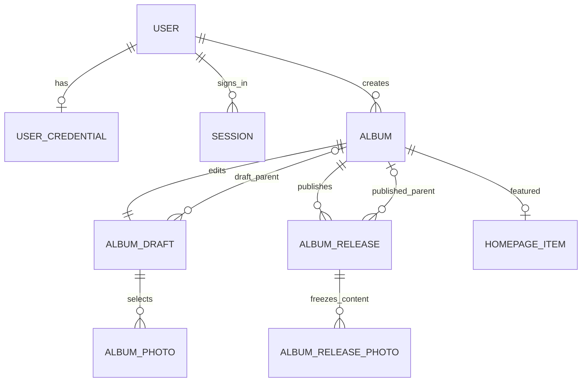

# Gallery 数据库设计与完整数据字典

状态：已确认。版本：0.1，2026-09-10。本文未执行任何建表操作。

## 1. 设计边界

同一 PostgreSQL 数据库内，Immich 表保留在 `public`，新增表位于 `gallery`。同库跨 schema 可以普通 JOIN；不使用跨数据库查询扩展。Gallery 的数据库角色、迁移和用户体系独立。

- Immich Asset 是资源身份；Gallery Album 是编辑与展示主体。
- 不保存 `source_album_id`，不限制一册来自一个 Immich 相册。
- Gallery 相册可直接选片，也可包含子相册；所有层级都可写游记。
- 不存 GPS 副本：公开地图实时通过受控视图读取 `public.asset_exif`，然后应用当前发布的公开精度。
- Gallery 文案、照片成员、排序、封面、父级与公开设置使用草稿／发布快照。
- 不给 Immich 核心表加字段、触发器或 Gallery 外键；自身表间正常使用外键。

## 2. 表目录：12 张业务表 + 1 张迁移表

| 表 | 用途 |
|---|---|
| `gallery.user` | 独立用户身份和角色 |
| `gallery.user_credential` | 密码哈希，与用户资料分开 |
| `gallery.session` | 可撤销登录会话 |
| `gallery.site` | 单站点配置及全局编辑并发版本 |
| `gallery.immich_source_owner` | 允许引用的 Immich 资源所有者白名单 |
| `gallery.album` | 相册稳定身份、slug、发布状态及当前版本指针 |
| `gallery.album_draft` | 当前相册草稿、父级和相册内容 |
| `gallery.album_photo` | 草稿中的直接照片、独立标题描述及顺序 |
| `gallery.album_release` | 不可变的发布内容快照，包含发布父级 |
| `gallery.album_release_photo` | 该次发布的选片、标题和描述快照 |
| `gallery.homepage_item` | 首页精选相册与顺序 |
| `gallery.audit_event` | 管理操作审计摘要 |
| `gallery.schema_migration` | Gallery 自己的迁移记录 |

不为留言、评分、收藏、缓存、地图聚合、分类或第三方登录预建空表。

## 3. 全局字段约定

- 表名和列名统一 snake_case，查询使用明确 schema；`gallery.user` 始终限定名称。
- 下列表格中“必填”表示 NOT NULL；明确标记“可空”的字段才允许 NULL。
- UUID 主键由应用生成 UUIDv4，不调用 Immich 自定义函数；无须把 UUID 当同步游标。
- 所有创建时间必填，默认 `now()`；更新时间必填，初始 `now()`，业务写入时更新。
- 版本号为 bigint，默认 1，CHECK > 0，服务端处理精度，不以 JavaScript 普通 number 承载任意 bigint。
- 状态使用 text + CHECK，避免依赖上游枚举。字符串限制、JSON 结构和 URL 校验由服务端执行，关键范围再落 DB CHECK。
- 所有 Gallery 外键默认 ON UPDATE RESTRICT。除特别说明的 CASCADE/SET NULL 外，ON DELETE RESTRICT。
- 管理员账号采用停用，不提供物理删除 UI；发布过的相册只下线，MVP 不硬删除。
- 空文档／对象／数组默认值均为明确 JSONB 字面量；封面、相机参数与正文内容由版本化校验器限制键集合。发布表没有草稿的宽松空标题默认值。

## 4. `gallery.user`

| 字段 | 定义 | 解释 |
|---|---|---|
| `id` | uuid，PK，必填 | Gallery 用户，与 Immich 用户无绑定关系 |
| `email` | text，必填 | 登录邮箱，保留用户输入的显示形式 |
| `email_normalized` | text，必填，UNIQUE | 统一去首尾空格、大小写规范化，用于登录和判重；不合并点号或加号别名 |
| `display_name` | text，必填 | 昵称，1–100 字符 |
| `role` | text，必填，默认 member | CHECK IN ('admin','member')；初始化命令显式创建 admin |
| `status` | text，必填，默认 active | CHECK IN ('active','disabled') |
| `created_at` | timestamptz，必填，默认 now() | 创建时间 |
| `updated_at` | timestamptz，必填，默认 now() | 修改时间 |

索引：主键、规范化邮箱唯一索引。MVP 不开放注册，未来注册接口只能服务端赋予 member。保留至少一个可用管理员由受控管理命令校验。

## 5. `gallery.user_credential`

| 字段 | 定义 | 解释 |
|---|---|---|
| `user_id` | uuid，PK，FK → user.id，必填 | 一人一条密码凭据；ON DELETE CASCADE |
| `password_hash` | text，必填 | 带算法及参数的自描述哈希，使用经过维护的密码库；算法参数在实现时基准测试后固定 |
| `password_changed_at` | timestamptz，必填，默认 now() | 最近密码变更时间 |
| `created_at` | timestamptz，必填，默认 now() | 创建时间 |
| `updated_at` | timestamptz，必填，默认 now() | 更新时间 |

不存明文、可逆密文或密码提示。密码变更与会话撤销在同一事务完成。该表不给公开数据库角色任何权限。

## 6. `gallery.session`

| 字段 | 定义 | 解释 |
|---|---|---|
| `id` | uuid，PK，必填 | 会话内部 ID |
| `user_id` | uuid，FK → user.id，必填 | ON DELETE CASCADE |
| `token_hash` | bytea，UNIQUE，必填 | 高熵随机令牌的 SHA-256 摘要；CHECK octet_length = 32；不是密码哈希 |
| `audience` | text，必填 | CHECK IN ('admin','public')；MVP 仅签发 admin |
| `created_at` | timestamptz，必填，默认 now() | 登录时间 |
| `expires_at` | timestamptz，必填 | CHECK expires_at > created_at |
| `revoked_at` | timestamptz，可空 | 撤销后不能再使用 |

索引：user_id、expires_at、token_hash 唯一索引。服务端每次校验 token、过期、撤销、用户启用状态和 audience。原令牌只用于 host-only HttpOnly Cookie；后台和未来前台不共享父域 Cookie。

## 7. `gallery.site`

| 字段 | 定义 | 解释 |
|---|---|---|
| `id` | smallint，PK，必填，CHECK id = 1 | 单站点记录；所有 Gallery 相册都属于它，无需在每张表重复 site_id |
| `name` | text，必填 | 站点名，1–100 字符 |
| `tagline` | text，必填，默认 '' | 简短标语 |
| `intro` | text，必填，默认 '' | 首页介绍 |
| `about_document` | jsonb，必填，默认空文档 | 关于正文；MVP 仅文本块和安全链接，不允许私有 Asset 引用 |
| `contact_links` | jsonb，必填，默认 [] | 受限的 label/url 列表，最多 10 项 |
| `hero_album_id` | uuid，可空，FK → album.id | 首页主视觉使用所选相册当前有效封面；允许先无主视觉 |
| `seo_description` | text，必填，默认 '' | 网站默认摘要 |
| `version` | bigint，必填，默认 1 | 站点设置与精选编辑的并发版本 |
| `tree_version` | bigint，必填，默认 1 | 相册草稿层级／排序变化及发布结构变化时递增，供树编辑冲突检测 |
| `updated_by` | uuid，可空，FK → user.id | 初始化可为空，管理操作必须填写 |
| `updated_at` | timestamptz，必填，默认 now() | 站点设置更新时间 |

domain、数据库密码、session secret、地图服务密钥不在此表，使用部署配置。tree_version 的更新不代表站点文字变更；操作详情进 audit_event。

## 8. `gallery.immich_source_owner`

这是一张资源范围配置表，不是两个产品的用户映射。

| 字段 | 定义 | 解释 |
|---|---|---|
| `immich_owner_id` | uuid，PK，必填 | 被允许读取的 Immich asset.ownerId，无跨 schema FK |
| `label` | text，必填，默认 '' | 本地配置说明，不复制完整 Immich 用户资料 |
| `enabled` | boolean，必填，默认 true | 禁用后，选片与公开请求立即排除该所有者资源 |
| `created_at` | timestamptz，必填，默认 now() | 加入时间 |
| `updated_at` | timestamptz，必填，默认 now() | 修改时间 |

仅由初始化／受控配置命令维护，常驻 gallery_admin 也不能写；public 角色只经视图间接使用。初始为空，不自动信任所有 Immich 用户。独立于 Gallery user.id，未来增加成员不会扩大资源来源范围。

## 9. `gallery.album`

| 字段 | 定义 | 解释 |
|---|---|---|
| `id` | uuid，PK，必填 | 稳定 Gallery 相册 ID |
| `slug` | text，UNIQUE，必填 | 1–120 字符，小写 ASCII 字母数字及连字符，无斜线；中文标题可配拼音或短 ID 地址 |
| `status` | text，必填，默认 draft | CHECK IN ('draft','published','offline') |
| `current_release_id` | uuid，可空 | 当前发布快照；下线时保留，但查询必须检查有效公开状态 |
| `version` | bigint，必填，默认 1 | 控制发布／下线／slug 等并发操作 |
| `created_by` | uuid，必填，FK → user.id | 创建管理员 |
| `created_at` | timestamptz，必填，默认 now() | 创建时间 |
| `updated_at` | timestamptz，必填，默认 now() | 相册管理状态更新时间 |
| `first_published_at` | timestamptz，可空 | 首次发布时间；一旦存在则 slug 不再可改 |
| `last_published_at` | timestamptz，可空 | 最近一次切换到发布快照的时间 |
| `offline_at` | timestamptz，可空 | 当前手动下线时间；仅被祖先阻断不修改自身字段 |

CHECK：draft 时 current_release_id/first_published_at/last_published_at/offline_at 均为空；published/offline 时前三者非空；published 时 offline_at 为空，offline 时非空。

组合 FK `(id,current_release_id) → album_release(album_id,id)`，确保不会指向别册版本。该 FK 在 release 表建立后添加，可延迟校验；NULL 指针适用于初始草稿。状态过滤与首次发布时间索引服务目录分页；其他列表先按索引＋实际查询计划优化。

本表没有 source_album_id，也不放可立即影响前台的 parent_album_id。父级保存在草稿和发布快照，避免保存草稿就改变线上结构。

## 10. `gallery.album_draft`

| 字段 | 定义 | 解释 |
|---|---|---|
| `album_id` | uuid，PK，FK → album.id，必填 | 每册唯一当前草稿，ON DELETE CASCADE |
| `parent_album_id` | uuid，可空，FK → album.id | 草稿父级；NULL 为顶级；CHECK parent_album_id <> album_id |
| `position` | bigint，必填，默认 0，CHECK >= 0 | 同级顺序键，允许间隔值；并列时按 album_id 稳定排序 |
| `title` | text，必填，默认 '' | 创建后可为空，发布时必须 1–200 字符 |
| `summary` | text，必填，默认 '' | 纯文本简介，最多 2000 字符 |
| `description_document` | jsonb，必填，默认空文档 | 相册富文本总体游记，含 schemaVersion |
| `cover_asset_id` | uuid，可空 | 明确引用封面 Asset，可为直接照片或有效公开后代照片；无跨库 FK |
| `cover_focal_point` | jsonb，可空 | {x,y}，各在 [0,1]，未设置时居中 |
| `location_mode` | text，必填，默认 hidden | CHECK IN ('hidden','approximate','exact')，本相册直接照片的位置公开上限 |
| `show_exif` | boolean，必填，默认 false | 是否显示筛选后的摄影参数 |
| `seo_title` | text，可空 | 空时使用相册标题 |
| `seo_description` | text，可空 | 空时使用简介 |
| `version` | bigint，必填，默认 1 | 任意正文、照片或草稿结构修改均递增 |
| `updated_by` | uuid，FK → user.id，必填 | 最后编辑者 |
| `updated_at` | timestamptz，必填，默认 now() | 更新时间 |

索引 `(parent_album_id,position,album_id)`，支持草稿树。非自指 CHECK 不能阻止多节点循环，完整防环与并发规则见发布文档。

## 11. `gallery.album_photo`

本表保存当前草稿的直接选片。它不是可被公众直接读取的照片表。

| 字段 | 定义 | 解释 |
|---|---|---|
| `id` | uuid，PK，必填 | Gallery 相册照片 ID，标题／排序修改时保持稳定 |
| `album_id` | uuid，FK → album_draft.album_id，必填 | ON DELETE CASCADE |
| `immich_asset_id` | uuid，必填 | 资源引用，无指向 Immich 的 FK |
| `position` | integer，必填，CHECK >= 0 | 相册内照片顺序 |
| `title` | text，必填，默认 '' | Gallery 独立标题，最多 200 字符 |
| `description` | text，必填，默认 '' | 独立多段纯文本描述，最多 10000 字符 |
| `alt_text` | text，必填，默认 '' | 替代文本，最多 500 字符 |
| `location_mode` | text，必填，默认 inherit | CHECK IN ('inherit','hidden','approximate','exact')；只能在相册上限内生效 |
| `created_at` | timestamptz，必填，默认 now() | 加入草稿时间 |
| `updated_at` | timestamptz，必填，默认 now() | 本记录修改时间 |

UNIQUE `(album_id,immich_asset_id)` 防止同册重复；UNIQUE `(album_id,position)` 设为可延迟，以便事务内批量换序；建立 `(immich_asset_id,album_id)` 反查索引。

每次新增、修改、移除照片必须锁定并更新 album_draft.version。移除草稿行不影响已有 release；重新加入同 Asset 可生成新 id，预览会提示旧照片链接在更新发布后失效。快照不外键关联这张可删除的草稿表。

## 12. `gallery.album_release`

| 字段 | 定义 | 解释 |
|---|---|---|
| `id` | uuid，PK，必填 | 发布版本 ID |
| `album_id` | uuid，FK → album.id，必填 | 所属相册 |
| `release_number` | integer，必填，CHECK > 0 | 册内递增，锁 album 行后分配 |
| `source_draft_version` | bigint，必填，CHECK > 0 | 发布源草稿版本，判断是否有未发布修改 |
| `parent_album_id` | uuid，可空，FK → album.id | 本版本的父级，非自指；公开树按各册 current_release 解析 |
| `position` | bigint，必填，CHECK >= 0 | 本次发布的同级顺序键 |
| `title` | text，必填 | 1–200 字符 |
| `summary` | text，必填 | 发布时简介 |
| `description_document` | jsonb，必填 | 发布时游记文档，必须通过结构校验 |
| `cover_asset_id` | uuid，可空 | 发布封面；无封面的纯父相册允许先发布，前台显示设计好的占位 |
| `cover_focal_point` | jsonb，可空 | 发布时裁切焦点 |
| `location_mode` | text，必填 | hidden/approximate/exact |
| `show_exif` | boolean，必填 | 发布时摄影参数公开设置 |
| `seo_title` | text，可空 | 发布时页面标题覆盖 |
| `seo_description` | text，可空 | 发布时摘要覆盖 |
| `content_schema_version` | integer，必填，默认 1，CHECK > 0 | 快照格式版本，与迁移版本不同 |
| `published_by` | uuid，FK → user.id，必填 | 发布管理员 |
| `published_at` | timestamptz，必填，默认 now() | 快照建立时间 |

UNIQUE `(album_id,id)` 服务组合 FK；UNIQUE `(album_id,release_number)` 防重复版本；索引 `(parent_album_id,position,album_id)` 服务公开树遍历。每次发布插入新行，不更新旧快照。

未在此表保存 GPS、城市、文件系统路径、密码或 Immich 描述。旧快照不意味着继续获得资源访问权。

## 13. `gallery.album_release_photo`

| 字段 | 定义 | 解释 |
|---|---|---|
| `release_id` | uuid，联合 PK，FK → album_release.id，必填 | 快照照片随快照清理，ON DELETE CASCADE |
| `photo_id` | uuid，联合 PK，必填 | 发布时 album_photo.id 的值，独立保存，不 FK 到可删除草稿行 |
| `immich_asset_id` | uuid，必填 | 资源引用，无跨 schema FK |
| `position` | integer，必填，CHECK >= 0 | 发布时顺序 |
| `title` | text，必填 | 发布时 Gallery 标题 |
| `description` | text，必填 | 发布时 Gallery 描述 |
| `alt_text` | text，必填 | 发布时替代文本 |
| `location_mode` | text，必填 | inherit/hidden/approximate/exact，按所属 release 的上限计算 |
| `public_exif` | jsonb，可空 | 仅 make/model/lensModel/fNumber/focalLength/iso/exposureTime 白名单快照；无 GPS |

UNIQUE `(release_id,immich_asset_id)`，UNIQUE `(release_id,position)`；索引 `(immich_asset_id,release_id)`。photo_id 是不可变快照内的逻辑照片身份；应用只有发布事务能写入快照，必须验证它来自该相册草稿。

宽高、可用衍生图和图片内容版本从当前受控资源投影读取，防止 Immich 重建预览后仍用陈旧尺寸。public_exif 在下次 Gallery 发布时更新；GPS 明确不在其中。

## 14. `gallery.homepage_item`

| 字段 | 定义 | 解释 |
|---|---|---|
| `album_id` | uuid，PK，FK → album.id，必填 | 一个相册最多精选一次 |
| `position` | integer，必填，CHECK >= 0 | UNIQUE，可延迟约束，支持批量换序 |
| `created_at` | timestamptz，必填，默认 now() | 加入精选时间 |

修改精选与 site.version 更新同一事务。记录存在不代表可展示，公开视图再次筛选有效公开状态。祖先下线时，相应精选入口自动隐藏。

## 15. `gallery.audit_event`

| 字段 | 定义 | 解释 |
|---|---|---|
| `id` | uuid，PK，必填 | 操作 ID |
| `actor_user_id` | uuid，可空，FK → user.id | 系统初始化可空；ON DELETE SET NULL |
| `action` | text，必填 | 如 album.publish、album.offline、site.update、account.password_reset、source.disable |
| `target_type` | text，必填 | album/site/user/source 等 |
| `target_id` | text，可空 | 对象 ID；多态引用不建立 FK，对象移除后仍保留记录 |
| `details` | jsonb，必填，默认 {} | 版本号、影响数量、结果等允许字段，不保存完整私有正文或凭据 |
| `created_at` | timestamptz，必填，默认 now() | 发生时间 |

索引 `(target_type,target_id,created_at)` 和 created_at。常驻管理角色只有 INSERT，无 UPDATE/DELETE；本期无审计管理 UI，日志保留策略交付时记录。

## 16. `gallery.schema_migration`

| 字段 | 定义 | 解释 |
|---|---|---|
| `version` | text，PK，必填 | 可排序编号，如 0001 |
| `name` | text，必填 | 迁移名称 |
| `checksum` | text，必填 | 文件校验值，发现已执行迁移被改写时拒绝继续 |
| `applied_at` | timestamptz，必填，默认 now() | 执行时间 |

迁移工具最终若需要额外的内部锁表，应记录为技术表并同步文档，不冒充业务表。MVP 使用数据库 advisory lock 串行迁移，事务内完成可事务化 DDL 后登记成功；失败原因记录运行日志。

## 17. 富文本结构

默认空文档为 `{"schemaVersion":1,"blocks":[]}`。JSON 顶层必须 object；应用使用版本化 schema 限定块与标记，限制最多 1000 块、UTF-8 序列化大小 1 MiB，超限提示管理员。普通站点关于文档只允许文本块。

```json
{
  "schemaVersion": 1,
  "blocks": [
    { "id": "b1", "type": "heading", "level": 2, "text": "清晨抵达" },
    {
      "id": "b2", "type": "paragraph",
      "children": [{ "text": "山谷里的光线逐渐明亮。", "marks": ["emphasis"] }]
    },
    {
      "id": "b3", "type": "photo_pair",
      "photoIds": ["11111111-1111-4111-8111-111111111111", "22222222-2222-4222-8222-222222222222"],
      "caption": "同一清晨的两个视角"
    }
  ]
}
```

图片引用 Gallery photoId，不使用任意文件路径或 HTML。保存时校验格式，发布时要求所有 photoId 都在该 release 的照片清单；移除正文引用的照片必须同时修改正文，否则拒绝发布。块 ID 在文档中唯一。

## 18. 关系图



图中未把 Immich 逻辑引用画成数据库 FK。`album.current_release_id` 是指向同册某次快照的组合 FK。公开树只使用当前快照，历史快照的 parent 不参与当前导航。

## 19. 数据库角色与视图

拟建对象均属于 gallery，名称待迁移落地时固定：

| 角色 | 授权范围 |
|---|---|
| `gallery_migrator` | 受控 Gallery DDL、迁移、初始用户与来源配置；不作为常驻服务账号 |
| `gallery_view_owner` | NOLOGIN；只获 Immich 必要列 SELECT，以及 Gallery 发布过滤所需表 SELECT |
| `gallery_admin` | 管理业务表读写、会话凭据、受限资源投影视图；快照仅 INSERT/SELECT，日志仅 INSERT；不写来源范围及迁移表 |
| `gallery_public` | 只读公开投影视图；不能直接读 Immich 核心表、用户、会话、草稿、历史快照 |

受控投影至少包含：admin_source_asset、admin_source_album、admin_source_tag、published_album、published_photo、published_site、published_homepage、published_cover。地图通过 published_photo 的已脱敏最新坐标查询，不另存聚合表。

初始化分为两层：首次由具备建角色及授权能力的数据库管理连接创建角色、Gallery schema，并给 NOLOGIN 视图所有者授予明确的 Immich 列级只读权限；后续普通 Gallery 迁移使用 gallery_migrator。不能假定只拥有 gallery schema 的角色可以自行授权访问 public 表。管理连接不进入常驻容器，初始化命令不把凭据输出到日志。

公开坐标脱敏在受控视图／受控数据库函数中完成，再交给 gallery_public；不能先赋予 public 角色原始 GPS 查询权限，再只靠 HTTP 层隐藏。内部媒体定位投影仅返回合格资源的允许衍生文件路径，路径只供服务端读取，HTTP DTO 始终移除。

视图使用明确 schema、NOLOGIN 所有者及经过验证的权限语义，涉及过滤的视图使用 security_barrier；目标需兼容当前 PostgreSQL 14，不依赖较新版本才支持的视图选项。表所有者/超级用户并非安全隔离对象，运行账号才是权限控制边界。

## 20. 一致性、迁移及保留

- 发布事务锁定站点树协调行及相关相册，验证预期版本、草稿树和拟发布树，再插入快照、切换指针、更新版本、写审计。
- GPS 不进入发布事务快照；发布后任何公开请求仍校验当前 Asset 状态与来源范围。
- 仅可删除从未发布且没有任何草稿子级、发布引用、封面/首页引用的相册；删除前清理允许清理的站点引用，并在同一事务检查。
- 已发布相册本期只下线；历史快照先保留，不提供任意历史 URL 或管理界面。后续清理必须排除当前指针，不能删到在线内容。
- 第一批迁移顺序：账号 → site（暂不加 hero FK）→ 来源范围 → album（暂不加 current FK）→ draft/photo → release/release_photo → 补组合 FK、hero FK → 首页、审计、视图和授权。
- 所有自定义对象由独立 Gallery 迁移管理，不修改 Immich 迁移记录。真实 SQL、约束错误回归与备份恢复由技术验证阶段交付。
- 当前文档是完整的逻辑字段设计，迁移尚未生成；不将其中任何表计为已存在。
